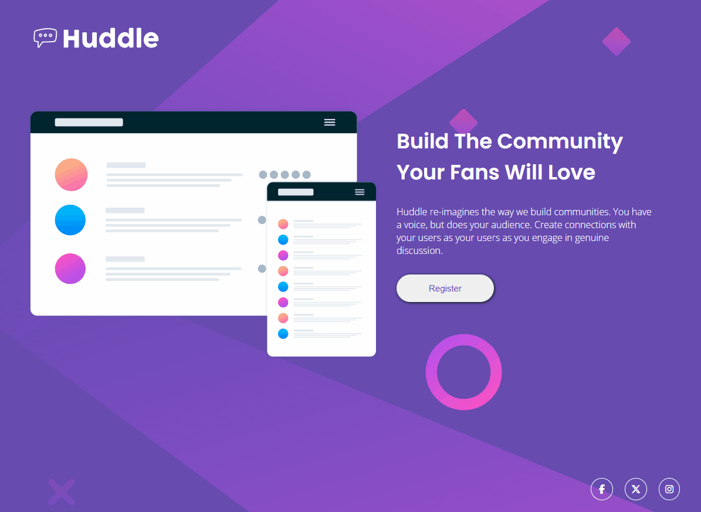

# Frontend Mentor - Huddle landing page with single introductory section solution

Esse foi a resolução do desafio [Huddle landing page with single introductory section challenge no Frontend Mentor](https://www.frontendmentor.io/challenges/huddle-landing-page-with-a-single-introductory-section-B_2Wvxgi0).

## [Vizualize o projeto clicando aqui](https://itsdavss.github.io/huddle-landing-page/) ##

## Tabela de conteúdos

- [Visão geral](#visão-geral)
  - [Desafio](#desafio)
  - [Screenshots](#screenshots)
- [Meu processo](#meu-processo)
  - [Dificuldades e aprendizados](#dificuldades-e-aprendizados)
  - [Desenvolvido com](#desenvolvido-com)
- [Autor](#autor)

## Visão geral

### Desafio

#### Design do desktop

#### Design ativo

### Screenshots

#### Desktop active design

#### Desktop mobile design

## Meu processo

### Dificuldades e aprendizados

Minha maior dificuldade no desenvolvimento desse desafio foi posicionar o footer, para isso eu utilizei a propriedade 'height' passando a medida 'vh' para dar a altura necessária para o Header, Main e Footer. Também tive uma certa dificuldade na responsividade com algumas medidas. 

### Desenvolvido com

- HTML5 
- CSS
- Flexbox

## Autor

- GitHub - [itsdavss](https://github.com/itsdavss)
- Meu portfólio - [Davi Oliveira](https://itsdavss.github.io/portfolio/)
- Frontend Mentor - [@itsdavss](https://www.frontendmentor.io/profile/itsdavss)
